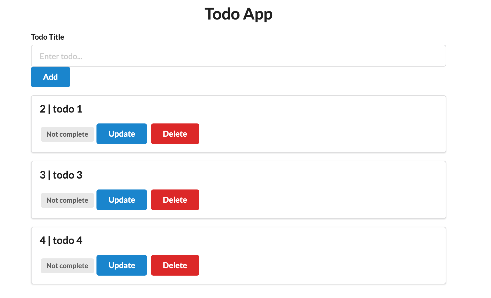

## Flask Todo App

### Description:
Simple Todo app created through flask. It allows users to add new to do items, delete and also toggle the status of complete and incomplete. 

### Dependencies:
* Flask-SQLAlchemy
* Jinja2
* SQLAlchemy

### Setup 
* Install and run virtual env:  `. venv/bin/activate`
* Use requirements file to install `pip install requirements.txt`
* Run the app `python3 app.py` or `python app.py`

## Images

